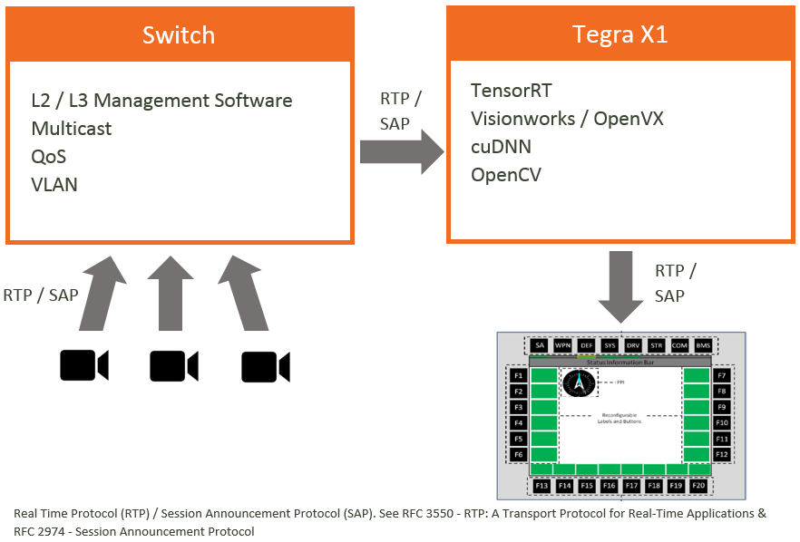
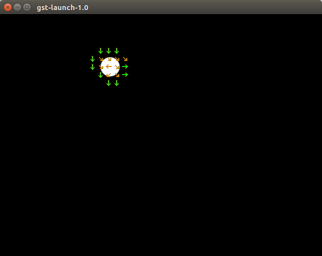
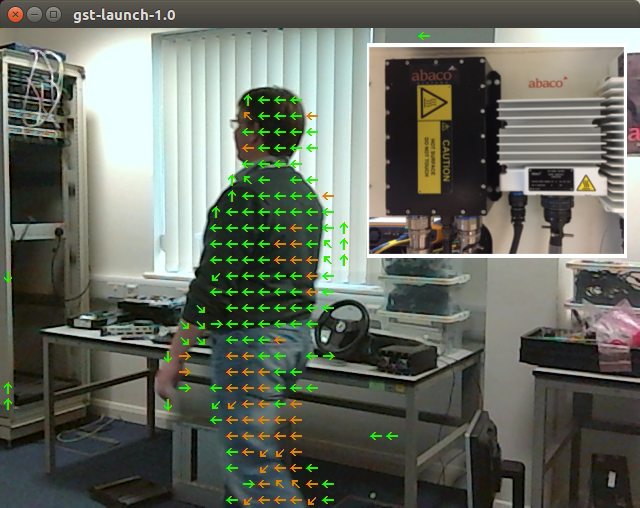

# Abaco Systems TX1 enabled Small Form Factor solutions   
## Modified motion-estimation for streaming video sources
TX1 Motion Estimation performed on RTP streaming video (YUV colour space as per RFQ 4175). Compatible with DEF-STAN 00-82

Please be patient whilst we fix some of the issues with this code.

- [x] Use Gstreamer1.0 for RTP nvxio FrameSource
- [x] Output video as raw RTP backets (no Gstreamer required) 
- [x] CUDA YUV to RGB conversion
- [x] CUDA RBG to YUV conversion
- [x] Output RTP stream with motion overlay
- [x] Colour code arrows based on speed (green=slow, amber=medium, red=fast)

Some additional features that are not currently planned.

- [ ] Support for interlaced DEF STAN 00-82 streams
- [ ] Support for other Uncompressed video formats (RGB, BGR etc ...)
- [ ] SAP support

## RTP streaming example for Military Ground Vehicles (DEF STAN 00-82)

## Build
#### 1. Cloning the repo
To obtain the repository, navigate to a folder of your choosing on the Jetson.  First, make sure git and cmake are installed locally:

``` bash
sudo apt-get install git cmake
```

Then clone the rtp-motion-estimation repo:
``` bash
git clone http://github.org/ross-abaco/rtp-motion-estimation
```

#### 2. Configuring

When cmake is run, a special pre-installation script (CMakePreBuild.sh) is run and will automatically install any dependencies.

``` bash
mkdir build
cd build
cmake ../
```

#### 3. Compiling

Make sure you are still in the motion-estimation/build directory, created above in step #2.

``` bash
cd motion-estimation/build			# omit if pwd is already /build from above
make
```
For jetson 64bit builds the architecte will be aarch64.

#### 4. Modifying

Some macros control how the demo can be run and there are located in [`config.h`](demos/config.h)
* HEADLESS 0 - Dont put anything out on the local display. Usefull for headless operation.
* GST_MULTICAST 1 - Set this for multicast sources
* RTP_STREAM_SOURCE - Define to use RTP Stream class as source (not gstreamer)
* GST_SOURCE 1 - 1 if RTP source, 0 if file source.
* GST_RTP_SINK 1 - RTP Output
* TIMEING_DEBUG 0 - Show timings in stdio

## Test
There are several test scripts provided in the root directory.
* [testFile01.sh](testFile01.sh) - Catch RTP output using Gstreamer
* [testRtp01.sh](testRtp01.sh) - Catch RTP output using Gstreamer
* [testRtp02.sh](testRtp02.sh) - Simple gst-launch-1.0 -v videotestsrc test with motion  (1280 x 720)
* [testRtp03.sh](testRtp03.sh) - Simple gst-launch-1.0 -v videotestsrc test without motion  (1280 x 720)
* [testRtp04-syntheticvideo.sh](testRtp04-syntheticvideo.sh) - Use a gstreamer videotessrc as input and RTP output (recommended)
* [testRtp05-webcam.sh](testRtp05-webcam.sh) - Use a webcam as input and RTP output 
* [testRtp06-file.sh](testRtp06-file.sh) - Use the test file 960 x 540 as input and RTP output 

Below is the example gstreamer pipline of a moving ball that can be used to test the algorithm :



Using gstreamer as a test source. 



Using a live RTP camera to stream video.

## Links
* [Abaco Systems](http://abaco.com)
* [eLinux TX1](http://elinux.org/Jetson_TX1)
* [Nvidia devtalk](https://devtalk.nvidia.com/default/board/164/)
* [Abaco Systems MC10K1 - Tegra TK1 Mini COM Express module](https://www.abaco.com/products/mcom10-k1-mini-com-express)
* [Abaco Systems GRA113 - Maxwel GPGPU 3U VPX](https://www.abaco.com/products/gra113-graphics-board)


